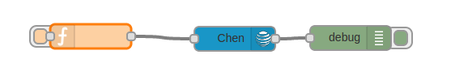

node-red-m2x
=================
A <a href="http://nodered.org" target="_new">Node-RED</a> node to store in <a href="http://m2x.att.com" target="_new">M2X</a>.

Install
-------

Run the following command in the root directory of your Node-RED Directory

    npm install node-red-m2x

Usage
-----

The user will set the following message proprties:

<ul>
    <li><b>msg.topic</b> - (required)
    <li><b>msg.sub_topic</b> - (optional)
    <li><b>msg.payload</b> - (optional)
    <li><b>msg.action</b> - (required)
    <li><b>msg.topic_id</b> - (optional)
    <li><b>msg.sub_topic_id</b> - (optional)
</ul>
<ul>
    <li> msg.topic - The type of object to act on - distribution,device,chart.key.
    <li> msg.action - An action to be applied for this type of object - The second level entry in the below list. (catalog for example)
    <li> msg.payload - A json that represent the body for the rest API, only if such is defiend.
    <li> msg.topic_id - a unique id for either device,distribution,key or chart
    <li> msg.sub_topic_id - define the a unique instance of sub topic such as distributon's device. 

    <ul>
        <li><b>devices</b>
            <ul>
            <li>catalog
                <ul>
                    <li><a href="https://m2x.att.com/developer/documentation/v2/device#List-Search-Public-Devices-Catalog"> Search Catalog </a>
                    <li> msg.payload - catalog parameters
                </ul>
            <li>create
                <ul>
                    <li><a href="https://m2x.att.com/developer/documentation/v2/device#Create-Device"> Create new device </a>
                    <li> msg.payload  - device parameters
                </ul>
            <li>createTrigger
                <ul>
                    <li><a href="https://m2x.att.com/developer/documentation/v2/device#Create-Trigger"> Create a new trigger associated with the specified device.</a>
                    <li> msg.topic_id - The device id
                    <li> msg.payload
                </ul>  
            <li>deleteDevice
                <ul>
                    <li><a href="https://m2x.att.com/developer/documentation/v2/device#Delete-Device"> Delete an existing device</a>
                    <li> msg.topic_id - The device id
                </ul>  
            <li>deleteStream
                <ul>
                    <li><a href="https://m2x.att.com/developer/documentation/v2/device#Delete-Data-Stream"> Delete  a stream</a>
                    <li> msg.topic_id - The device id
                    <li> msg.sub_topic_id - The stream name
                </ul>    
            <li>deleteStreamValues
                <ul>
                    <li><a href="https://m2x.att.com/developer/documentation/v2/device#Delete-Data-Stream-Values"> Delete values from a stream by a date range</a>
                    <li> msg.topic_id - The device id
                    <li> msg.sub_topic_id - The stream name
                    <li> msg.payload - parameters - time range
                </ul>
            <li>deleteTrigger
                <ul>
                    <li><a href="https://m2x.att.com/developer/documentation/v2/device#Delete-Trigger">  Delete an existing trigger associated with a specific device.</a>
                    <li> msg.topic_id - The device id
                    <li> msg.sub_topic_id - The trigger id
                </ul>        
            <li>groups
                <ul>
                    <li><a href="https://m2x.att.com/developer/documentation/v2/device#List-Device-Groups"> List Groups of devices</a>
                </ul>
            <li>keys
                <ul>
                    <li> Returns a list of API keys associated with the device
                    <li> msg.topic_id - The device id
                </ul>  
            <li>list
                <ul>
                    <li><a href="https://m2x.att.com/developer/documentation/v2/device#List-Search-Devices"> List Devices </a>
                    <li> msg.payload - The device id
                </ul>
            <li>location
                <ul>
                    <li><a href="https://m2x.att.com/developer/documentation/v2/device#Read-Device-Location"> View device current location</a>
                    <li> msg.topic_id - The device id
                </ul>  
            <li>log
                <ul>
                    <li><a href="https://m2x.att.com/developer/documentation/v2/device#View-Request-Log"> Return a list of access log to the supplied device</a>
                    <li> msg.topic_id - The device id
                </ul>     
            <li>postMultiple
                <ul>
                    <li><a href="https://m2x.att.com/developer/documentation/v2/device#Post-Device-Updates--Multiple-Values-to-Multiple-Streams-"> Post multiple values to multiple streams</a>
                    <li> msg.topic_id - The device id
                    <li> msg.payload - parameters 
                </ul>    
            <li>postValues
                <ul>
                    <li><a href="https://m2x.att.com/developer/documentation/v2/device#Post-Data-Stream-Values"> Post timestamped values to an existing stream</a>
                    <li> msg.topic_id - The device id
                    <li> msg.sub_topic_id - The stream name
                    <li> msg.payload - parameters - the values - 
                    <pre>[{ "timestamp": "timeStamp" "value": "value" },
{ "timestamp": "timeStamp","value": "value>"}]</pre>
                </ul> 
            <li>sampleStreamValues
                <ul>
                    <li><a href="https://m2x.att.com/developer/documentation/v2/device#Data-Stream-Sampling"> Sample values from an existing stream</a>
                    <li> msg.topic_id - The device id
                    <li> msg.sub_topic_id - The Name of the stream
                    <li> msg.payload
                </ul>     
            <li>setStreamValue
                <ul>
                    <li><a href="https://m2x.att.com/developer/documentation/v2/device#Update-Data-Stream-Value"> Set the stream value</a>
                    <li> msg.topic_id - The device id
                    <li> msg.sub_topic_id - The stream name
                    <li> msg.payload - parameters - the values
                </ul>  
            <li>stream
                <ul>
                    <li><a href="https://m2x.att.com/developer/documentation/v2/device#View-Data-Stream"> View stream details </a>
                    <li> msg.topic_id - The device id
                    <li> msg.sub_topic_id - The stream name
                    <li> msg.payload 
                </ul>
            <li>streamStats
                <ul>
                    <li><a href="https://m2x.att.com/developer/documentation/v2/device#Data-Stream-Stats"> Stream Statistics </a>
                    <li> msg.topic_id - The device id
                    <li> msg.sub_topic_id - The stream name
                    <li> msg.payload 
                </ul>
            <li>streamValues
                <ul>
                    <li><a href="https://m2x.att.com/developer/documentation/v2/device#List-Data-Stream-Values"> List data stream values </a>
                    <li> msg.topic_id - The device id
                    <li> msg.sub_topic_id - The stream name
                    <li> msg.payload 
                </ul>    
            <li>streams
                <ul>
                    <li><a href="https://m2x.att.com/developer/documentation/v2/device#List-Data-Streams"> Return list of associated streams</a>
                    <li> msg.topic_id - The device id
                    <li> msg.sub_topic_id - The Name of the stream
                    <li> msg.payload
                </ul>  
            <li>testTrigger
                 <ul>
                    <li><a href="https://m2x.att.com/developer/documentation/v2/device#Test-Trigger"> Test the specified trigger by firing it with a fake value.</a>
                    <li> msg.topic_id - The device id
                    <li> msg.sub_topic_id - The trigger id
                </ul>        
            <li>trigger
                <ul>
                    <li><a href="https://m2x.att.com/developer/documentation/v2/device#View-Trigger"> Get details of a specific trigger associated with an existing device</a>
                    <li> msg.topic_id - The device id
                    <li> msg.sub_topic_id - The trigger ID
                </ul>      
            <li>triggers
                <ul>
                    <li><a href="https://m2x.att.com/developer/documentation/v2/device#List-Triggers"> Retrieve list of triggers associated with the specified device.</a>
                    <li> msg.topic_id - The device id
                </ul>    
            <li>update
                <ul>
                    <li><a href="https://m2x.att.com/developer/documentation/v2/device#Update-Device-Details"> Update a device </a>
                    <li> msg.topic_id - The device id
                    <li> msg.payload 
                </ul>
            <li>updateLocation                <ul>
                    <li><a href="https://m2x.att.com/developer/documentation/v2/device#Update-Device-Location"> Update a device location </a>
                    <li> msg.topic_id - The device id
                    <li> msg.payload 
                </ul>
            <li>updateStream
                <ul>
                    <li><a href="https://m2x.att.com/developer/documentation/v2/device#Create-Update-Data-Stream"> Update a data stream</a>
                    <li> msg.topic_id - The device id
                    <li> msg.sub_topic_id - The Name of the stream
                    <li> msg.payload - parameters
                </ul>
            <li>updateStreams
                <ul>
                    <li><a href="https://m2x.att.com/developer/documentation/v2/device#Create-Update-Data-Stream"> Update a data stream</a>
                    <li> msg.topic_id - The device id
                    <li> msg.sub_topic_id - Array of streams names
                    <li> msg.payload - parameters
                </ul>    
            <li>updateTrigger
                <ul>
                    <li><a href="https://m2x.att.com/developer/documentation/v2/device#List-Data-Stream-Values">Update an existing trigger associated with the specified device. </a>
                    <li> msg.topic_id - The device id
                    <li> msg.sub_topic_id - The trigger name
                    <li> msg.payload - trigger parameters 
                </ul>    
            <li>view
                 <ul>
                    <li><a href="https://m2x.att.com/developer/documentation/v2/device#View-Device-Details"> View device </a>
                    <li> msg.topic_id - The device id
                </ul>   
            </ul>
    </ul>
    <ul>
        <li><b>distribution</b>
        <ul>    
            <li>addDevice     
                <ul>
                    <li><a href="https://m2x.att.com/developer/documentation/v2/distribution#Add-Device-to-an-existing-Distribution">Add a new device to an existing device distribution</a>
                    <li> msg.topic_id - The distribution id
                    <li> msg.sub_topic_id - The device id
                </ul>      
            <li>create
                <ul>
                    <li><a href="https://m2x.att.com/developer/documentation/v2/distribution#Create-Distribution">Create a new device distribution </a>
                    <li> msg.payload - Create parameters
                </ul>
            <li>createTrigger
                <ul>
                    <li><a href="https://m2x.att.com/developer/documentation/v2/distribution#Create-Trigger">Create a new trigger associated with the distribution</a>
                    <li> msg.topic_id - The distribution id
                    <li> msg.payload - trigger parameters 
                </ul>      
            <li>dataStream
                <ul>
                    <li><a href="https://m2x.att.com/developer/documentation/v2/distribution#View-Data-Stream">View information about a stream associated to the distribution</a>
                    <li> msg.topic_id - The distribution id
                    <li> msg.sub_topic_id - The stream name
                </ul> 
            <li>datatStreams
                <ul>
                    <li><a href="https://m2x.att.com/developer/documentation/v2/distribution#List-Data-Streams">Retrieve a list of data streams associated with the distribution</a>
                    <li> msg.topic_id - The distribution id
                </ul>        
            <li>deleteDataStream
                <ul>
                    <li><a href="https://m2x.att.com/developer/documentation/v2/distribution#Delete-Data-Stream">Delete an existing data stream associated to distribution</a>
                    <li> msg.topic_id - The distribution id
                    <li> msg.sub_topic_id - The stream name

                </ul>        
            <li>deleteDistribution
                <ul>
                    <li><a href="https://m2x.att.com/developer/documentation/v2/distribution#Delete-Distribution">Delete an existing device distribution</a>
                    <li> msg.topic_id - The distribution id
                </ul>      
            <li>deleteTrigger
                <ul>
                    <li><a href="https://m2x.att.com/developer/documentation/v2/distribution#Delete-Trigger">Delete a trigger associated to the distribution</a>
                    <li> msg.topic_id - The distribution id
                    <li> msg.sub_topic_id - The trigger id
                </ul>     
            <li>devices
               <ul>
                    <li><a href="https://m2x.att.com/developer/documentation/v2/distribution#List-Devices-from-an-existing-Distribution"> Retrieve a list of devices added to the a device distribution </a>
                    <li> msg.topic_id - The distribution id
                </ul>    
            <li>list
                <ul>
                    <li><a href="https://m2x.att.com/developer/documentation/v2/distribution#List-Distributions">Retrieve a list of device distributions </a>
                    <li> msg.payload - List parameters
                </ul>
            <li>testTrigger
                <ul>
                    <li><a href="https://m2x.att.com/developer/documentation/v2/distribution#Test-Trigger">Test a trigger by firing a fake value</a>
                    <li> msg.topic_id - The distribution id
                    <li> msg.sub_topic_id - The trigger id
                </ul>      
            <li>trigger
                <ul>
                    <li><a href="https://m2x.att.com/developer/documentation/v2/distribution#View-Trigger">Retrieve information about a trigger associated to a distribution</a>
                    <li> msg.topic_id - The distribution id
                    <li> msg.sub_topic_id - The trigger id
                </ul>       
            <li>triggers
               <ul>
                    <li><a href="https://m2x.att.com/developer/documentation/v2/distribution#List-Triggers"> Retrieve list of triggers associated with the distribution </a>
                    <li> msg.topic_id - The distribution id
                </ul>    
            <li>update
                <ul>
                    <li><a href="https://m2x.att.com/developer/documentation/v2/distribution#Update-Distribution-Details">Update an existing device distribution</a>
                    <li> msg.topic_id - The distribution id
                    <li> msg.payload - distribution parameters 
                </ul>     
            <li>updateDataStream
                <ul>
                    <li><a href="https://m2x.att.com/developer/documentation/v2/distribution#Create-Update-Data-Stream">Create/Update a data stream associated with the distribution. </a>
                    <li> msg.topic_id - The distribution id
                    <li> msg.sub_topic_id - The stream name
                    <li> msg.payload - stream parameters 
                </ul>     
            <li>updateTrigger
                <ul>
                    <li><a href="https://m2x.att.com/developer/documentation/v2/distribution#Update-Trigger">Update an existing trigger associated with the distribution</a>
                    <li> msg.topic_id - The distribution id
                    <li> msg.sub_topic_id - The trigger id
                    <li> msg.payload - trigger parameters 
                </ul>        
            <li>view
                 <ul>
                    <li><a href="https://m2x.att.com/developer/documentation/v2/distribution#View-Distribution-Details"> Retrieve information about an existing device distribution </a>
                    <li> msg.topic_id - The disribution id
                </ul>     
        </ul>   
    </ul>
    <ul>
        <li><b>charts</b>
        <ul>
            <li>create
                <ul>Get details of a chart
                    <li><a href="https://m2x.att.com/developer/documentation/v2/charts#Create-Chart">Create a new chart</a>
                    <li> msg.payload - chart parameters 
                </ul>      
            <li>deleteChart
                <ul>
                    <li><a href="https://m2x.att.com/developer/documentation/v2/charts#Delete-Chart">Delete an existing chart</a>
                    <li> msg.topic_id - The chart id
                </ul>    
            <li>list
                 <ul>
                    <li><a href="https://m2x.att.com/developer/documentation/v2/charts#List-Charts">Retrieve a list of charts that belongs to the user </a>
                </ul>       
            <li>render
                <ul>
                    <li><a href="https://m2x.att.com/developer/documentation/v2/charts#Render-Chart">Retrieve a rendering of a given chart as image format</a>
                    <li>msg.topic_id - The chart id
                    <li>msg.sub_topic_id - the image format : "svg" or "png"
                </ul>
            <li>update
                  <ul>
                    <li><a href="https://m2x.att.com/developer/documentation/v2/charts#Update-Chart">Update an existing chart</a>
                    <li> msg.topic_id - The chart id
                    <li> msg.payload - chart parameters -<pre>{ series : [{device: "device-id", stream:"stream_name" }]}</pre>
                </ul>  
            <li>view
                <ul>
                    <li><a href="https://m2x.att.com/developer/documentation/v2/charts#View-Chart-Details">Get details of a chart</a>
                    <li> msg.topic_id - The chart id
                </ul>
        </ul>   
    </ul>
    <ul>
        <li><b>keys</b>
        <ul>
            <li>create
                <ul>
                    <li><a href="https://m2x.att.com/developer/documentation/v2/keys#Create-Key">Create a new API Key</a>
                    <li> msg.payload - key parameters
                </ul>      
            <li>del
                <ul>
                    <li><a href="https://m2x.att.com/developer/documentation/v2/charts#Delete-Chart">Delete an existing chart</a>
                    <li> msg.topic_id - The key id
                </ul>        
            <li>list
                <ul>
                    <li><a href="https://m2x.att.com/developer/documentation/v2/keys#List-Keys">List all the Master API Keys that belongs to the authenticated user</a>
                </ul>          
            <li>regenerate
                <ul>
                    <li><a href="https://m2x.att.com/developer/documentation/v2/keys#Regenerate-Key">Regenerate an API Key token</a>
                    <li> msg.topic_id - The key id
                </ul>        
            <li>update
                <ul>
                    <li><a href="https://m2x.att.com/developer/documentation/v2/keys#Update-Key">Update API Key properties</a>
                    <li> msg.topic_id - The key id
                    <li> msg.payload - key parameters
                </ul>      
            <li>view
                <ul>
                    <li><a href="https://m2x.att.com/developer/documentation/v2/keys#View-Key-Details">Return the details of the API Key supplied</a>
                    <li> msg.topic_id - The key id
                </ul>    
        </ul>
    </ul>
</ul>    
    

    <H3>Authentication</H3>
    There are 2 ways to pass authentication using the flow designer M2X Node.
    <ul>
        <li>Used the node configuration and set the relevant X-M2X-KEY.
        <li>Pass the X-M2X-KEY via msg.m2x_key.
    </ul>
    

    

    
    <H3> Examples </H3>
    <H4> Create Trigger </H4>
    <H5> Function Code </H5>
    <pre>
msg.topic = "devices"; 
msg.action = "createTrigger"; 
msg.topic_id = "1b2f98cc3b31b527c27ba14fe46c615c"; 
msg.payload = { "stream": "heat",   
  "name": "Hightemperature3",   
  "condition": ">",  
  "value": 100,  
  "callback_url": "http://example.com",  
  "status": "enabled",   
  "send_location": true };  

    </pre>
    <H4> Show device Details<H4>    
    <H5> Function Code </H5>
    <pre>
    msg.topic = "devices"; 
    msg.action = "view"; 
    msg.topic_id = "1b2f98cc3b31b527c27ba14fe46c615c"; 
    return msg; 
    </pre>
    

       
